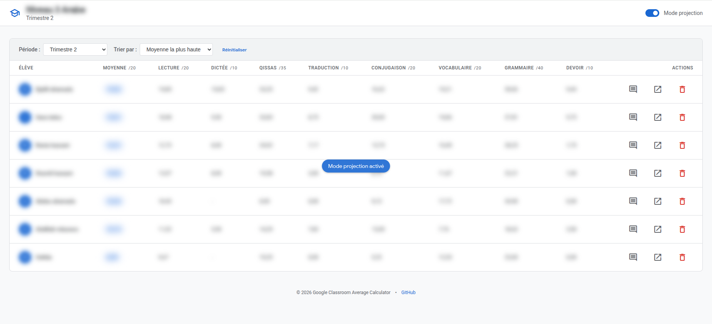

# Google Classroom Average Calculator



Ce projet répond à plusieurs limites fonctionnelles de Google Classroom dans le cadre du suivi pédagogique des élèves.

En particulier :

- **Absence de périodes pédagogiques personnalisables** : Google Classroom ne permet pas de définir des périodes d’évaluation (par exemple : trimestre, semestre ou période libre) basées sur une plage de dates. Cela limite la capacité à analyser les résultats sur des segments temporels cohérents.
- **Manque de flexibilité dans le calcul des moyennes** : Les moyennes sont généralement exprimées en pourcentage, ce qui ne correspond aux systèmes de notation utilisés (ex : notes sur 10, 20, 40, etc.).
- **Absence de normalisation des résultats** : Il n’existe pas de mécanisme natif permettant d’agréger et de normaliser les notes provenant de devoirs hétérogènes afin de produire une moyenne cohérente et comparable.

Ce projet apporte une couche de traitement permettant :
- de définir des périodes d’analyse personnalisées
- de normaliser les notes
- de calculer des moyennes adaptées au contexte pédagogique


## 🚀 Environnement technique

| Technologie | Version |
|---|---------|
| [FrankenPHP](https://frankenphp.dev/) | 1.12.x  |
| [PHP](https://www.php.net/) | 8.4.x   |
| [Symfony](https://symfony.com/) | 8.x     |
| [MySQL](https://www.mysql.com/) | 8.x     |
| [PHPUnit](https://phpunit.de/) | 13      |
| [Google Classroom API](https://developers.google.com/classroom), [Google Docs API](https://developers.google.com/docs/api), [Google Drive API](https://developers.google.com/drive/api) | —       |

## 🛠 Installation et Configuration

### 1. Pré-requis
*   Docker et Docker Compose installés.
*   Un compte Google avec accès à Google Classroom.

### 2. Installer les dépendances
```bash
make build
```

### 3. Configuration Google Cloud & API
Pour que l'application puisse communiquer avec Google, vous devez configurer vos identifiants dans le fichier `.env`.

#### A. Obtenir le Client ID et le Client Secret
1.  Allez sur la [Console Google Cloud](https://console.cloud.google.com/).
2.  Créez un nouveau projet.
3.  Assurez-vous d'avoir bien activé les APIs mentionnées [https://console.cloud.google.com/apis/library](https://console.cloud.google.com/apis/library)
    :
    * **Google Classroom API**
    * **Google Docs API**
    * **Google Drive API**
4.  Configurez l'écran de consentement OAuth (choisissez "Externe" ou "Interne" selon vos besoins).
    *   Ajoutez le scope : `https://www.googleapis.com/auth/classroom.courses.readonly`
    *   Ajoutez le scope : `https://www.googleapis.com/auth/classroom.coursework.me.readonly`
    *   Ajoutez le scope : `https://www.googleapis.com/auth/classroom.coursework.students.readonly`
    *   Ajoutez le scope : `https://www.googleapis.com/auth/classroom.topics.readonly`
    *   Ajoutez le scope : `https://www.googleapis.com/auth/classroom.rosters.readonly`
    *   Ajoutez le scope : `https://www.googleapis.com/auth/drive.file`
    *   Ajoutez le scope : `https://www.googleapis.com/auth/documents`
5.  Allez dans **Identifiants** > **Créer des identifiants** > **ID de client OAuth**.
6.  Sélectionnez **Application de bureau**.
7.  Copiez votre `Client ID` et votre `Client Secret` dans votre fichier `.env` du projet :
    ```env
    GOOGLE_CLIENT_ID=votre_id
    GOOGLE_CLIENT_SECRET=votre_secret
    GOOGLE_BULLETIN_TEMPLATE_DOCUMENT_ID=id_du_document_modele
    GOOGLE_BULLETIN_OUTPUT_FOLDER_ID=id_du_dossier_de_destination
    ```

#### B. Générer le Refresh Token
Une fois le ID et Secret configurés, utilisez la commande intégrée pour obtenir votre token de rafraîchissement permanent :

```bash
php bin/console app:google:generate-refresh-token
```

1.  Ouvrez l'URL affichée dans votre navigateur.
2.  Connectez-vous et validez les autorisations.
3.  Copiez le code fourni par Google et collez-le dans votre terminal.
4.  Copiez le `Refresh Token` obtenu et ajoutez-le à votre `.env` :
    ```env
    GOOGLE_REFRESH_TOKEN=votre_refresh_token
    ```

## 💻 Interface et Commandes

#### Démarrage

```bash
make run
```

L’application est disponible sur : http://localhost:8001

### 📄 Génération des Bulletins
L'application permet de générer des bulletins scolaires au format Google Docs à partir d'un modèle.

1.  **Préparation du modèle** : Créez un Google Doc contenant des placeholders comme `{{student_fullname}}`, `{{lecture_average}}`, `{{rank}}`, etc.
2.  **Configuration** : Renseignez `GOOGLE_BULLETIN_TEMPLATE_DOCUMENT_ID` et `GOOGLE_BULLETIN_OUTPUT_FOLDER_ID` dans votre `.env`.
3.  **Génération** : Depuis l'interface web, cliquez sur le bouton "Bulletin" en face d'un élève.

### 🏫 Gestion des classes et élèves

#### Lister les cours
Affiche la liste de tous vos cours Google Classroom avec leurs IDs.
```bash
php bin/console app:classroom:list-courses
```

#### Lister les élèves d'un cours
Affiche les élèves d'un cours spécifique et les enregistre/met à jour en base de données locale.
```bash
php bin/console app:classroom:list-students [courseId]
```

### 📊 Calcul des moyennes

#### Calculer la moyenne d'un élève
Calcule la moyenne par matière et la moyenne générale.
```bash
php bin/console app:classroom:compute-average "Nom de l'élève" --courseId=[ID] --start-date=[DATE_DEBUT] --end-date=[DATE_FIN]
```

> **Note sur le cache :** Si un calcul a déjà été effectué pour un élève sur la même période, l'application récupérera le résultat en base de données au lieu d'appeler l'API Google.

## 📚 Documentation
- [Documentation Google Classroom API](https://developers.google.com/workspace/classroom?hl=fr)
- [Google APIs Client Library for PHP](https://github.com/googleapis/google-api-php-client)
